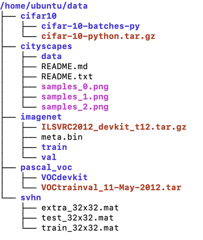

# Benchmarks for [AutoAlbument](https://github.com/albumentations-team/autoalbument) - AutoML for Image Augmentation.

## Results

### CIFAR-10 (Classification)
- Model: Wide-Resnet-28-10.
- Baseline augmentation strategy: Horizontal Flip with probability 0.5.
- Configs: [AutoAlbument augmentation search](https://github.com/albumentations-team/autoalbument/tree/c0b18955b0036c753866bedc02c8c2c1fff73ded/examples/cifar10) | [Baseline training](conf/cifar10_baseline.yaml) | [AutoAlbument training](conf/cifar10_autoalbument.yaml).

| Augmentation strategy     | Top-1 Accuracy | Top-5 Accuracy |
|---------------------------|:--------------:|:--------------:|
| Baseline                  |      90.24     |      99.61     |
| AutoAlbument              |    **95.09**   |    **99.83**   |

### SVHN (Classification)
- Model: Wide-Resnet-28-10.
- Both `train` and `extra` sets are used for training.
- Baseline augmentation strategy: no augmentations.
- Configs: [AutoAlbument augmentation search](https://github.com/albumentations-team/autoalbument/tree/c0b18955b0036c753866bedc02c8c2c1fff73ded/examples/svhn) | [Baseline training](conf/svhn_baseline.yaml) | [AutoAlbument training](conf/svhn_autoalbument.yaml).

| Augmentation strategy     | Top-1 Accuracy | Top-5 Accuracy |
|---------------------------|:--------------:|:--------------:|
| Baseline                  |      98.05     |      99.70     |
| AutoAlbument          |    **98.25**   |    **99.75**   |

### ImageNet (Classification)
- Model: ResNet-50.
- Baseline augmentation strategy:
  - Resize an image to 256x256 pixels.
  - Crop a random 224x224 pixels patch.
  - Apply Horizontal Flip with probability 0.5.
- AutoAlbument augmentation strategy:
  - Resize an image to 256x256 pixels.
  - Crop a random 224x224 pixels patch.
  - Apply AutoAlbument augmentation policies.
- Configs: [AutoAlbument augmentation search](https://github.com/albumentations-team/autoalbument/tree/c0b18955b0036c753866bedc02c8c2c1fff73ded/examples/imagenet) | [Baseline training](conf/imagenet_baseline.yaml) | [AutoAlbument training](conf/imagenet_autoalbument.yaml).

| Augmentation strategy     | Top-1 Accuracy | Top-5 Accuracy |
|---------------------------|:--------------:|:--------------:|
| Baseline                  |      67.76     |      87.40     |
| AutoAlbument          |    **70.00**   |    **89.10**   |

### Pascal VOC (Semantic segmentation)
- Model: DeepLab-v3-plus.
- Baseline augmentation strategy:
  - Resize an image preserving its aspect ratio, so the longest size is 256 pixels.
  - If required, pad an image to the size 256x256 pixels.
  - Apply Horizontal Flip with probability 0.5.
- AutoAlbument augmentation strategy:
  - Resize an image preserving its aspect ratio, so the longest size is 256 pixels.
  - If required, pad an image to the size 256x256 pixels.
  - Apply AutoAlbument augmentation policies.
- Configs: [AutoAlbument augmentation search](https://github.com/albumentations-team/autoalbument/tree/c0b18955b0036c753866bedc02c8c2c1fff73ded/examples/pascal_voc) | [Baseline training](conf/pascal_voc_baseline.yaml) | [AutoAlbument training](conf/pascal_voc_autoalbument.yaml).

| Augmentation strategy     | mIOU           |
|---------------------------|:--------------:|
| Baseline                  |      73.34     |
| AutoAlbument          |    **75.55**   |

### Cityscapes
- Model: DeepLab-v3-plus.
- Baseline augmentation strategy:
  - Resize an image preserving its aspect ratio, so the longest size is 256 pixels.
  - If required, pad an image to the size 256x256 pixels.
  - Apply Horizontal Flip with probability 0.5.
- AutoAlbument augmentation strategy:
  - Resize an image preserving its aspect ratio, so the longest size is 256 pixels.
  - If required, pad an image to the size 256x256 pixels.
  - Apply AutoAlbument augmentation policies.
- Configs: [AutoAlbument augmentation search](https://github.com/albumentations-team/autoalbument/tree/c0b18955b0036c753866bedc02c8c2c1fff73ded/examples/cityscapes) | [Baseline training](conf/cityscapes_baseline.yaml) | [AutoAlbument training](conf/cityscapes_autoalbument.yaml).

| Augmentation strategy     | mIOU           |
|---------------------------|:--------------:|
| Baseline                  |      79.47     |
| AutoAlbument          |    **79.92**   |

## How to run the benchmarks
1. Download datasets and put them in the following directory structure:
   
2. Clone this repository.
3. Run the `run.sh` script that will build a Docker image and train models using the following command:

`./run.sh </path/to/data/directory> </path/to/outputs/directory>`

e.g.
`./run.sh ~/data ~/outputs`

where
- `</path/to/data/directory>` is a path to a directory that contains datasets (e.g., a directory that contains folders `imagenet`, `pascal_voc`, etc)
- `</path/to/outputs/directory>` is a path to a directory that should contain outputs from a training pipeline, such as a CSV log with metrics and a checkpoint with the best model.
